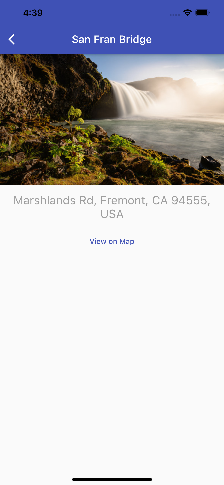

[![Contributors][contributors-shield]][contributors-url]
[![Forks][forks-shield]][forks-url]
[![Stargazers][stars-shield]][stars-url]
[![Issues][issues-shield]][issues-url]

<br />
<p align="center">
  <a href="https://github.com/ajvelo/My-Favorite-Places">
  
  </a>

  <h3 align="center">My Favorite Places</h3>

  <p align="center">
  An application where you can find and save your favorite places, share them with friends and check out new ones!
    <br />
    <a href="https://github.com/ajvelo/My-Favorite-Places"><strong>Explore the docs »</strong></a>
    <br />
    <br />
    <a href="https://github.com/ajvelo/My-Favorite-Places">View Demo</a>
    ·
    <a href="https://github.com/ajvelo/My-Favorite-Places/issues">Report Bug</a>
    ·
    <a href="https://github.com/ajvelo/My-Favorite-Places/issues">Request Feature</a>
  </p>
</p>


<!-- TABLE OF CONTENTS -->
<details open="open">
  <summary><h2 style="display: inline-block">Table of Contents</h2></summary>
  <ol>
    <li>
      <a href="#about-the-project">About The Project</a>
      <ul>
        <li><a href="#built-with">Built With</a></li>
      </ul>
    </li>
    <li>
      <a href="#getting-started">Getting Started</a>
      <ul>
        <li><a href="#prerequisites">Prerequisites</a></li>
        <li><a href="#installation">Installation</a></li>
      </ul>
    </li>
  </ol>
</details>


<!-- ABOUT THE PROJECT -->
## About The Project

An application where you can find and save your favorite places, share them with friends and check out new ones!


### Built With

This project is built with Flutter.

A few resources to get you started if this is your first Flutter project:

- [Lab: Write your first Flutter app](https://flutter.dev/docs/get-started/codelab)
- [Cookbook: Useful Flutter samples](https://flutter.dev/docs/cookbook)

For help getting started with Flutter, view our
[online documentation](https://flutter.dev/docs), which offers tutorials,
samples, guidance on mobile development, and a full API reference.


<!-- GETTING STARTED -->
## Getting Started

To get a local copy up and running follow these simple steps.

### Prerequisites

Follow the steps on [flutter dev](https://flutter.dev/) to install the Flutter SDK

### Installation

1. Clone the repo
   ```sh
   git clone https://github.com/ajvelo/My-Favorite-Places.git
   ```
2. Install packages
   ```sh
   flutter packages get
   ```

## Usage

You can upload pictures of your favorite places, then share and tag your friends in them!



You can also see where you've been tagged in your friends images!


<!-- ROADMAP -->
## Roadmap

See the [open issues](https://github.com/ajvelo/My-Favorite-Places/issues) for a list of proposed features (and known issues).


<!-- CONTRIBUTING -->
## Contributing

Contributions are what make the open source community such an amazing place to be learn, inspire, and create. Any contributions you make are **greatly appreciated**.

1. Fork the Project
2. Create your Feature Branch (`git checkout -b feature/AmazingFeature`)
3. Commit your Changes (`git commit -m 'Add some AmazingFeature'`)
4. Push to the Branch (`git push origin feature/AmazingFeature`)
5. Open a Pull Request


[contributors-shield]: https://img.shields.io/github/contributors/ajvelo/My-Favorite-Places.svg?style=for-the-badge
[contributors-url]: https://github.com/ajvelo/My-Favorite-Places/graphs/contributors
[forks-shield]: https://img.shields.io/github/forks/ajvelo/My-Favorite-Places.svg?style=for-the-badge
[forks-url]: https://github.com/ajvelo/My-Favorite-Places/network/members
[stars-shield]: https://img.shields.io/github/stars/ajvelo/My-Favorite-Places.svg?style=for-the-badge
[stars-url]: https://github.com/ajvelo/My-Favorite-Places/stargazers
[issues-shield]: https://img.shields.io/github/issues/ajvelo/My-Favorite-Places.svg?style=for-the-badge
[issues-url]: https://github.com/ajvelo/My-Favorite-Places/issues
